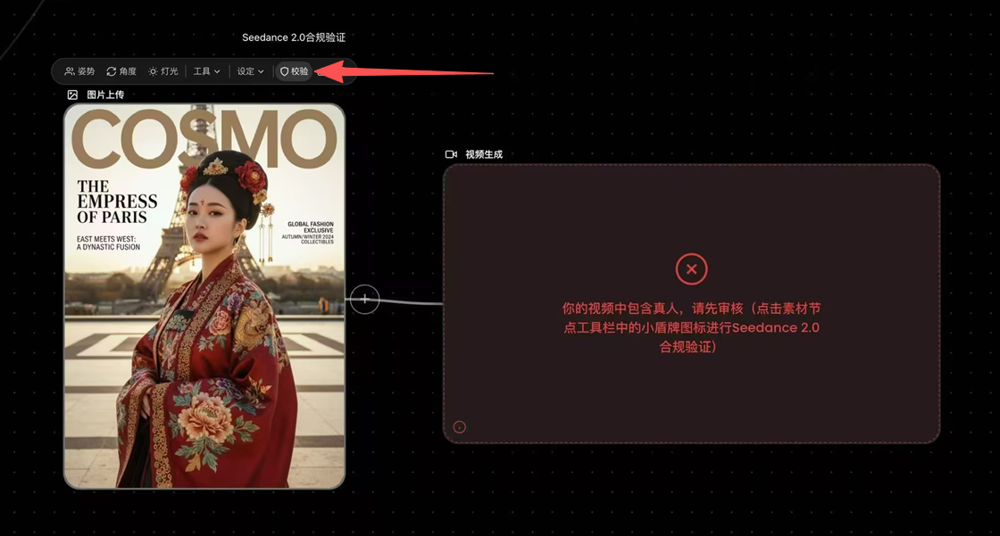

# 常见问题解决方案

## 真人卡审核

1. 点击素材上方校验工具，通过校验后即可正常使用。

2. 素材较多时，也可在全能参考模式中点击“批量”按钮进行批量验证。

## 敏感信息拦截

1. 建议先检查提示词中是否有涉政涉黄等敏感信息。

2. 如果自查后仍无法解决，可以将TaskID复制后再产品交流群中发送给客服，客服将会帮助您排查问题。

3. 被拦截的视频会返还积分。

## 版权限制拦截

1. 如果您的素材确实与版权角色相似度较高，建议修改自己的素材或者增加尝试次数。

2. 也可能是因为参考图中人脸占比过小导致的人脸漂移进而触发版权问题。建议采取下列方式强化人脸参考的独立性和权重:\(1\)准备人脸特写图:在原有全身照之外，额外准备1张只包含角色头部的人脸特写图\(大头照，仅保留面部，无表情最佳，尽量减少肩颈、背景等干扰元素\);\(2\)提示词中主体定义清晰:\<主体1\>的面部特征参考图片1\(大头照\)，妆造参考图片2\(全身照\);\(3\)重要素材前置:越需要 精准参考 的素材，放在提示词中越靠前的位置;\(4\)注意人物参考使用大头照\+全身照即可，不建议使用人物多视图。多视图素材包含同一人物的不同角度模型易将其识别为多个不同主体，反而加剧ID漂移问题。

3. 如果按照上述方式修改后如果仍出现版权问题，建议多次提交增加尝试次数或将TaskID发送给客服查询设计版权。

## 视频或节点丢失

1. 可以参考图片中的标注来找到生成记录。

## 视频中包含字幕

1. 目前无法直接做到 100% 避免生成字幕，只能通过以下方法降低其出现概率、提升抽卡成功率。（1）在提示词中加入明确的约束指令：“保持无字幕”、“避免生成任何文字或字幕”；（2）如果参考的图片/视频中包含的文字并非必要信息，建议先通过工具去除文字（例如使用 Seedream/ Seedance 模型的图片/视频编辑能力），再使用无文字素材作为输入；（3）在业务允许的前提下，优先选择横屏尺寸生成视频（横屏生成字幕的概率明显低于竖屏），后续可通过剪辑软件裁剪为竖屏。

2. seedance官方提供了免费去字幕功能，该系列模型生成出的视频可以在23h内免费去除字幕。

## 视频中有水印

1. 在提示词中加入明确的约束指令：“不要生成水印”、“不要生成Logo” 。

## 视频风格漂移

1. 在提示词中加入明确的风格约束词，例如“2D日漫风格”、“3D国风漫画”。如果需要更精准的风格控制，建议将参考图先变为目标风格再进行生视频。

2. 注意：参考图风格不一致可能会影响到生成视频的风格！

## 双胞胎问题

目前无法直接做到 100% 避免双胞胎问题，只能通过以下方法降低其出现概率、提升抽卡成功率。

1. 明确人物主体关联

在提示词中清晰定义每个人物角色，明确角色与参考图的对应关系。建议在人物名称后标注对应参考图，并保持格式统一。

示例：张三（对应图片 1）将绿色存折扔向站立的李四（对应图片 2）。

2. 添加全局约束指令

在提示词末尾增加固定约束： 视频全程禁止出现外形、着装、配饰完全一致的人物，禁止生成同款分身、双胞胎效果，同一画面中仅保留单个对应人物，不出现人物重复复刻 。

3. 优化参考素材

人物参考图优先使用单人独立照片，不建议使用三视图、多视图素材。

4. 精简优化提示词

请勿直接将完整剧本作为提示词使用，文案内容过度冗余易造成模型理解混乱，需精简无关表述、保证指令清晰聚焦。

## 中文发音不准

1. 可将易读错文字替换为 **发音一致的常用同音字** ，规避发音偏差，还原预期音频效果。注意该方案仅为优化手段，无法完全规避所有发音问题。示例：可将提示词中“螭龙山”改写为同音字“吃龙山”。

## 提示词教程

1. sd2\.5提示词参考：https://docs\.volcengine\.com/docs/82379/2607689?lang=zh

2. sd2\.0提示词参考：https://docs\.volcengine\.com/docs/82379/2222480?lang=zh

3. MiniMax H3 模型 \- 使用手册[🐚MiniMax H3 模型 \- 使用手册](https://vrfi1sk8a0.feishu.cn/wiki/FIWjwgL33ipnkekzk30crmKUnIh)

4. Wan 3\.0视频创作者手册：https://alidocs\.dingtalk\.com/i/nodes/qnYMoO1rWxrkmoj2IjExdZLBJ47Z3je9?utm\_medium=dingdoc\_doc\_plugin\_url\&utm\_scene=team\_space\&utm\_source=dingdoc\_doc

5. 草帽小蔡笔记：https://w\-3d4po\.neowow\.studio/

## 智能体生成到一半卡住

1. 对话框输入“继续”即可继续之前的任务。

## 积分发放与过期

1. 每日赠送积分和订阅积分都会在每天凌晨陆续发放。

2. 每日赠送积分会在次日失效。订阅积分每月过期。团队订阅积分在会员过期12个月后失效，如果期间续订会员，则随新会员周期延续。充值积分长期有效。

## 协作画布积分不足

1. 按照上述步骤将充值积分或团队积分划转入协作画布即可。

